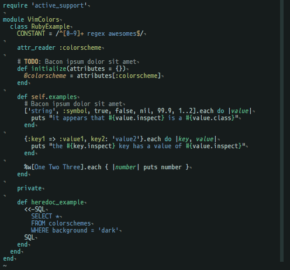

# Odyssey for Vim

Odyssey is a dark green colorscheme for Vim.

## Features

Odyssey is a dark theme for Vim which provides the following features:

  + A color scheme based on 12 colors.

  + Support for 256-color terminals, 24-bits color terminals and GUI.

  + A better syntax for the following programming languages: Go, Java,
    JavaScript, Python, Ruby and Rust.

## Visuals

This is a little screenshot to see the color scheme in action:



## Installation

### Downloading the plugin

#### Using [pathogen.vim]

After having installed [pathogen.vim], clone the repository under
`./vim/bundle`.
  ```zsh
  cd ~/.vim/bundle/
  git clone https://github.com/ludokng/vim-odyssey.git vim-odyssey/
  ```

#### Using Vim 8 native package manager

Clone the repository under `.vim/pack/vim-odyssey/start/`.
  ```zsh
  cd ~/.vim/pack/
  mkdir -p vim-odyssey/start/
  cd vim-odyssey/start/
  git clone https://github.com/ludokng/vim-odyssey.git vim-odyssey/
  ```

*Note*: The first `vim-odyssey` directory name is arbitrary as specified in the
        Vim documentation.

### Updating the `./vimrc`

Add the following to the `./vimrc` file.

  + For GUI versions of Vim:

    ```vim
    colorscheme odyssey
    ```

  + For terminals that support true color, if 24-bits colors are required, the
    following lines must be used:

    ```vim
    set termguicolors
    colorscheme odyssey
    ```

  + For terminals that support 256-colors, if 8-bits colors are required, the
    following lines must be used:

    ```vim
    set t_Co=256
    colorscheme odyssey
    ```

## License

Odyssey for Vim is distributed under the terms of the MIT license.

## Project Status

This project was a one-shot project. It is no more under development, but the
color scheme is completely useable and has been used during its development.
Some issues may be addressed if there are bugs. However existing features will
not be changed and no additional ones are planned.

[pathogen.vim]:  https://github.com/tpope/vim-pathogen
